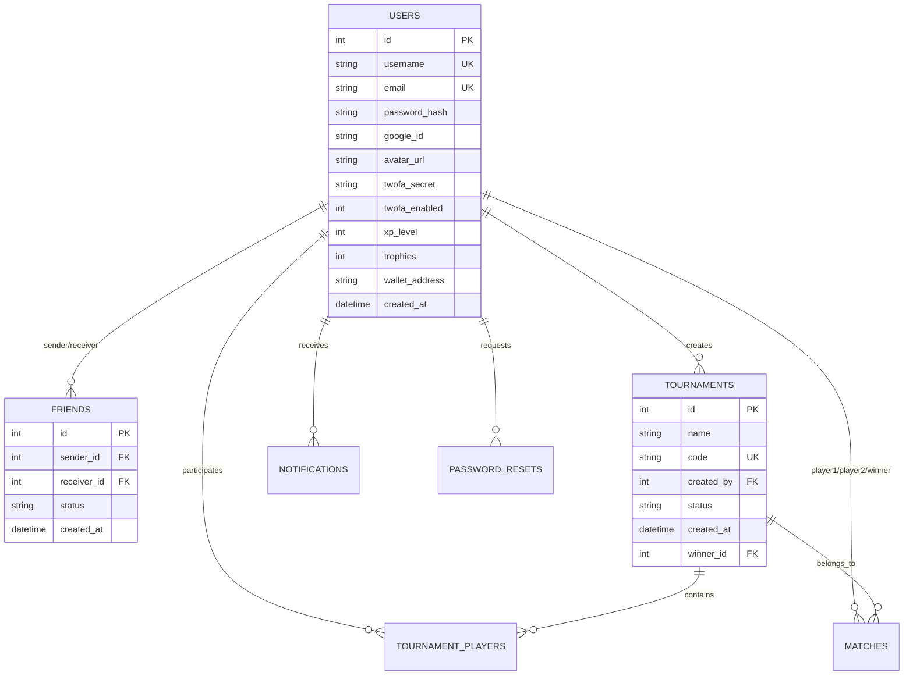
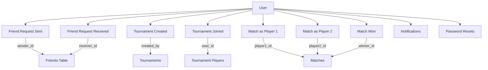
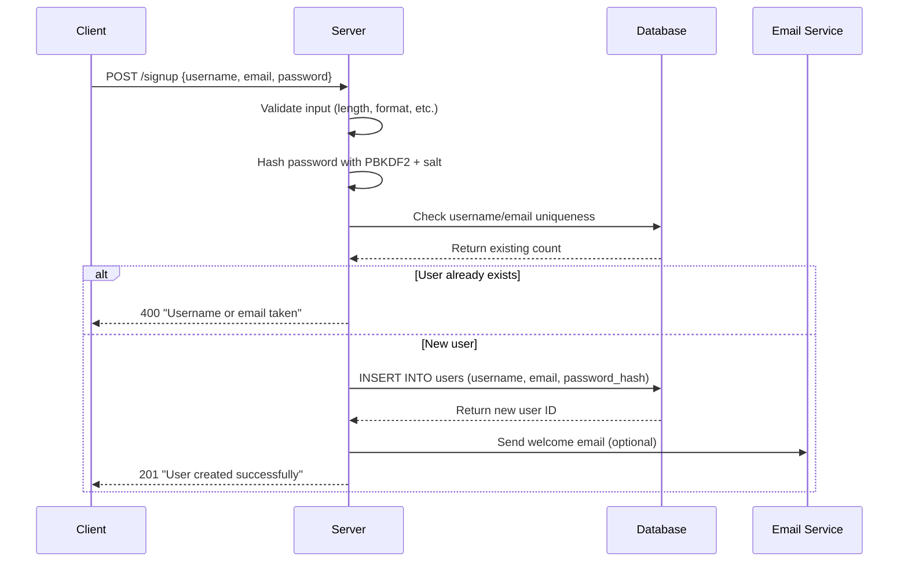
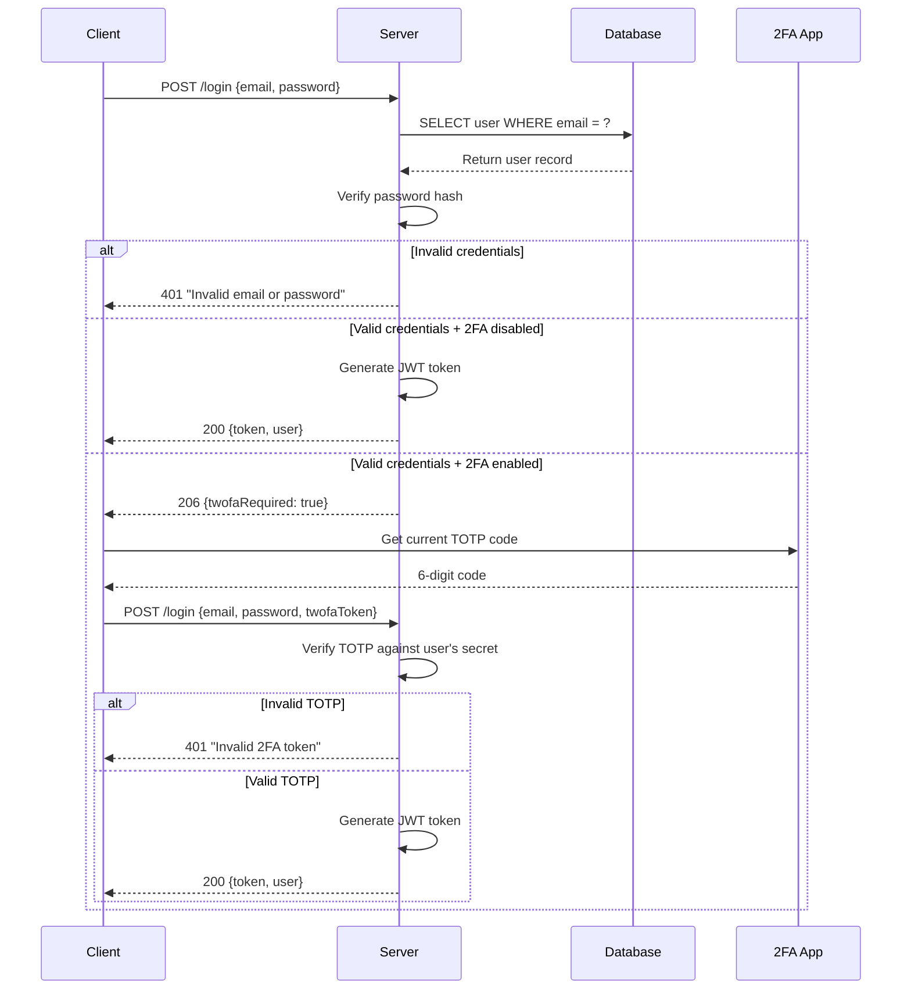
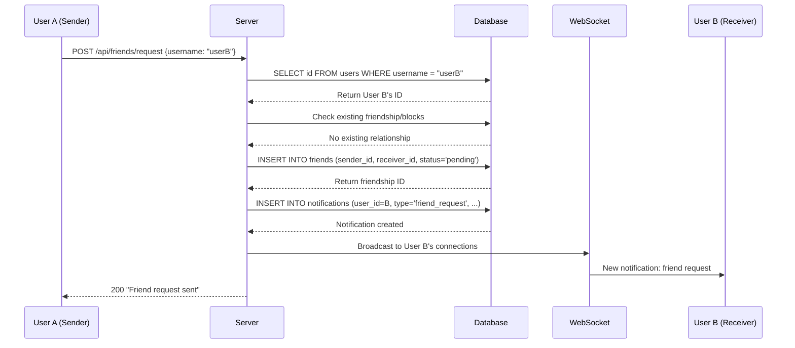

# Database Schema & User Management Deep Dive

## Table of Contents
1. [Schema Overview](#schema-overview)
2. [User Management Tables](#user-management-tables)
3. [Relationship Diagrams](#relationship-diagrams)
4. [Data Flow Examples](#data-flow-examples)
5. [Security Implementation](#security-implementation)
6. [Query Examples](#query-examples)

---

## Schema Overview

The database follows **Third Normal Form (3NF)** principles to eliminate data redundancy and ensure data integrity. Here's the complete entity relationship structure:



---

## User Management Tables

### 1. Users Table - Core User Data

```sql
CREATE TABLE IF NOT EXISTS users (
  id INTEGER PRIMARY KEY AUTOINCREMENT,
  username TEXT UNIQUE NOT NULL,
  email TEXT UNIQUE,
  password_hash TEXT,
  google_id TEXT,
  avatar_url TEXT,
  twofa_secret TEXT,
  twofa_enabled INTEGER DEFAULT 0,
  xp_level INTEGER DEFAULT 0,
  trophies INTEGER DEFAULT 0,
  wallet_address TEXT,
  created_at DATETIME DEFAULT CURRENT_TIMESTAMP
);
```

#### Field Explanations:

| Field | Type | Purpose | Constraints |
|-------|------|---------|-------------|
| `id` | INTEGER PK | Unique identifier, auto-incrementing | Primary Key |
| `username` | TEXT | Display name for user | UNIQUE, NOT NULL, min 2 chars |
| `email` | TEXT | Login identifier & communication | UNIQUE, valid email format |
| `password_hash` | TEXT | Hashed password using PBKDF2 | NULL for OAuth-only users |
| `google_id` | TEXT | Google OAuth identifier | NULL for password users |
| `avatar_url` | TEXT | Profile picture path | Relative path to uploads/ |
| `twofa_secret` | TEXT | Base32 secret for TOTP | Generated by speakeasy |
| `twofa_enabled` | INTEGER | 2FA status flag | 0 = disabled, 1 = enabled |
| `xp_level` | INTEGER | Game experience points | Defaults to 0 |
| `trophies` | INTEGER | Tournament wins counter | Defaults to 0 |
| `wallet_address` | TEXT | Blockchain wallet address | For smart contract integration |
| `created_at` | DATETIME | Registration timestamp | Auto-generated |

#### User States & Lifecycle:

```typescript
type UserState = 
  | 'pending'      // Just registered, email not verified
  | 'active'       // Normal active user
  | 'suspended'    // Temporarily banned
  | 'deleted';     // Soft deleted account

// Example user progression:
// 1. User registers → password_hash created
// 2. User enables 2FA → twofa_secret generated, twofa_enabled = 1  
// 3. User connects wallet → wallet_address populated
// 4. User wins tournaments → trophies incremented
```

### 2. Friends System - Social Relationships

```sql
CREATE TABLE IF NOT EXISTS friends (
  id INTEGER PRIMARY KEY AUTOINCREMENT,
  sender_id INTEGER NOT NULL,
  receiver_id INTEGER NOT NULL,
  status TEXT CHECK(status IN ('pending', 'accepted', 'blocked')) NOT NULL DEFAULT 'pending',
  created_at DATETIME DEFAULT CURRENT_TIMESTAMP,
  FOREIGN KEY (sender_id) REFERENCES users(id),
  FOREIGN KEY (receiver_id) REFERENCES users(id)
);
```

#### Friendship State Machine:

```typescript
type FriendshipStatus = 'pending' | 'accepted' | 'blocked';

// State transitions:
// pending → accepted (receiver accepts request)
// pending → blocked (receiver blocks sender)  
// accepted → blocked (either party blocks the other)
// No direct transition from blocked to accepted (must create new request)
```

#### Friend Request Logic:

```typescript
interface FriendRequest {
    id: number;
    sender: User;
    receiver: User;
    status: FriendshipStatus;
    created_at: Date;
}

// Business rules:
// 1. Cannot send request to yourself
// 2. Cannot send duplicate pending requests
// 3. Blocked users cannot send requests to each other
// 4. Accepting a request creates bidirectional friendship
```

### 3. Notifications System

```sql
CREATE TABLE IF NOT EXISTS notifications (
  id INTEGER PRIMARY KEY AUTOINCREMENT,
  user_id INTEGER NOT NULL,
  type TEXT NOT NULL,
  reference_id INTEGER,
  text TEXT NOT NULL,
  is_read INTEGER DEFAULT 0,
  created_at DATETIME DEFAULT CURRENT_TIMESTAMP,
  FOREIGN KEY(user_id) REFERENCES users(id)
);
```

#### Notification Types:

```typescript
type NotificationType = 
  | 'friend_request'     // reference_id = friends.id
  | 'game_invite'        // reference_id = challenges.id
  | 'tournament_invite'  // reference_id = tournaments.id
  | 'match_result'       // reference_id = matches.id
  | 'achievement'        // reference_id = achievement_id
  | 'system_message';    // reference_id = null

interface Notification {
    id: number;
    user_id: number;
    type: NotificationType;
    reference_id?: number;
    text: string;
    is_read: boolean;
    created_at: Date;
}

// Examples:
const notifications: Notification[] = [
    {
        id: 1,
        user_id: 123,
        type: 'friend_request',
        reference_id: 45, // friends table id
        text: 'john_doe sent you a friend request',
        is_read: false,
        created_at: new Date()
    },
    {
        id: 2,  
        user_id: 123,
        type: 'match_result',
        reference_id: 67, // matches table id
        text: 'You won against alice_player! +50 XP',
        is_read: false,
        created_at: new Date()
    }
];
```

### 4. Password Reset System

```sql
CREATE TABLE IF NOT EXISTS password_resets (
  id INTEGER PRIMARY KEY AUTOINCREMENT,
  user_id INTEGER NOT NULL,
  code_hash TEXT NOT NULL,
  expires_at INTEGER NOT NULL,
  used INTEGER NOT NULL DEFAULT 0,
  FOREIGN KEY (user_id) REFERENCES users(id)
);
```

#### Reset Flow Implementation:

```typescript
interface PasswordReset {
    id: number;
    user_id: number;
    code_hash: string;    // Hashed 6-digit code
    expires_at: number;   // Unix timestamp
    used: boolean;
}

// Password reset workflow:
class PasswordResetService {
    async initiateReset(email: string): Promise<string> {
        const user = await this.findUserByEmail(email);
        const code = this.generateRandomCode(); // 6-digit numeric
        const codeHash = this.hashCode(code);
        const expiresAt = Date.now() + (15 * 60 * 1000); // 15 minutes
        
        await db.prepare(`
            INSERT INTO password_resets (user_id, code_hash, expires_at)
            VALUES (?, ?, ?)
        `).run(user.id, codeHash, expiresAt);
        
        await this.sendResetEmail(user.email, code);
        return 'Reset code sent';
    }
    
    async validateReset(email: string, code: string, newPassword: string): Promise<boolean> {
        const user = await this.findUserByEmail(email);
        const reset = await db.prepare(`
            SELECT * FROM password_resets 
            WHERE user_id = ? AND used = 0 AND expires_at > ?
            ORDER BY created_at DESC LIMIT 1
        `).get(user.id, Date.now());
        
        if (!reset || !this.verifyCode(code, reset.code_hash)) {
            return false;
        }
        
        // Update password and mark reset as used
        const passwordHash = this.hashPassword(newPassword);
        await db.prepare('UPDATE users SET password_hash = ? WHERE id = ?')
               .run(passwordHash, user.id);
        await db.prepare('UPDATE password_resets SET used = 1 WHERE id = ?')
               .run(reset.id);
        
        return true;
    }
}
```

---

## Relationship Diagrams

### User-Centric View



### Data Access Patterns

```typescript
// Common queries and their relationships:

// 1. Get user's friends with online status
const getUserFriends = (userId: number) => db.prepare(`
    SELECT 
        u.id, u.username, u.avatar_url,
        f.status, f.created_at,
        CASE WHEN ws.user_id IS NOT NULL THEN 1 ELSE 0 END as is_online
    FROM friends f
    JOIN users u ON (
        CASE 
            WHEN f.sender_id = ? THEN u.id = f.receiver_id
            ELSE u.id = f.sender_id 
        END
    )
    LEFT JOIN websocket_sessions ws ON ws.user_id = u.id
    WHERE (f.sender_id = ? OR f.receiver_id = ?) 
    AND f.status = 'accepted'
`).all(userId, userId, userId);

// 2. Get user's match history with opponent details
const getUserMatchHistory = (userId: number) => db.prepare(`
    SELECT 
        m.*,
        u1.username as player1_name,
        u2.username as player2_name,
        winner.username as winner_name,
        t.name as tournament_name
    FROM matches m
    JOIN users u1 ON m.player1_id = u1.id
    JOIN users u2 ON m.player2_id = u2.id  
    LEFT JOIN users winner ON m.winner_id = winner.id
    LEFT JOIN tournaments t ON m.tournament_id = t.id
    WHERE m.player1_id = ? OR m.player2_id = ?
    ORDER BY m.played_at DESC
`).all(userId, userId);

// 3. Get user's tournament participation
const getUserTournaments = (userId: number) => db.prepare(`
    SELECT 
        t.*,
        creator.username as created_by_name,
        winner.username as winner_name,
        tp.joined_at
    FROM tournaments t
    JOIN tournament_players tp ON t.id = tp.tournament_id
    JOIN users creator ON t.created_by = creator.id
    LEFT JOIN users winner ON t.winner_id = winner.id
    WHERE tp.user_id = ?
    ORDER BY t.created_at DESC
`).all(userId);
```

---

## Data Flow Examples

### 1. User Registration Flow



### 2. Login with 2FA Flow



### 3. Friend Request Flow



---

## Security Implementation

### Password Security

```typescript
// backend/utils/hash.ts - Production-grade password hashing
import crypto from 'crypto';

const ROUNDS = 100_000;    // OWASP recommended minimum
const DKLEN = 64;          // 64-byte derived key length
const DIGEST = 'sha512';   // Strong hash function

export function hashPassword(plain: string, salt?: string): string {
    // Generate cryptographically secure random salt
    const saltBuffer = salt ? Buffer.from(salt, 'hex') : crypto.randomBytes(16);
    const saltHex = saltBuffer.toString('hex');
    
    // Derive key using PBKDF2
    const hash = crypto.pbkdf2Sync(plain, saltHex, ROUNDS, DKLEN, DIGEST);
    
    // Store salt:hash format for verification
    return `${saltHex}:${hash.toString('hex')}`;
}

export function verifyPassword(plain: string, stored: string): boolean {
    const [saltHex, originalHash] = stored.split(':');
    if (!saltHex || !originalHash) return false;
    
    // Derive hash with same parameters
    const derivedHash = crypto.pbkdf2Sync(plain, saltHex, ROUNDS, DKLEN, DIGEST);
    
    // Timing-safe comparison prevents timing attacks
    return crypto.timingSafeEqual(derivedHash, Buffer.from(originalHash, 'hex'));
}

// Password strength validation
export function validatePasswordStrength(password: string): string[] {
    const errors: string[] = [];
    
    if (password.length < 8) errors.push('Must be at least 8 characters');
    if (!/[A-Z]/.test(password)) errors.push('Must contain uppercase letter');
    if (!/[a-z]/.test(password)) errors.push('Must contain lowercase letter');
    if (!/\d/.test(password)) errors.push('Must contain number');
    if (!/[^A-Za-z\d]/.test(password)) errors.push('Must contain special character');
    if (/(.)\1{2,}/.test(password)) errors.push('No more than 2 repeated characters');
    
    return errors;
}
```

### JWT Token Management

```typescript
// backend/utils/jwt.ts - Secure token handling
import jwt from 'jsonwebtoken';

export interface JWTPayload {
    userId: number;
    username: string; 
    email: string;
    iat?: number;  // Issued at
    exp?: number;  // Expires at
    jti?: string;  // JWT ID for revocation
}

const JWT_SECRET = process.env.JWT_SECRET!;
const TOKEN_EXPIRY = '7d';

export function generateToken(payload: Omit<JWTPayload, 'iat' | 'exp' | 'jti'>): string {
    const jti = crypto.randomUUID(); // Unique token ID
    
    return jwt.sign(
        { ...payload, jti },
        JWT_SECRET,
        { 
            expiresIn: TOKEN_EXPIRY,
            issuer: 'transcendence-api',
            audience: 'transcendence-clients'
        }
    );
}

export function verifyToken(token: string): JWTPayload {
    return jwt.verify(token, JWT_SECRET, {
        issuer: 'transcendence-api',
        audience: 'transcendence-clients'
    }) as JWTPayload;
}

// Token blacklist for logout/revocation
const blacklistedTokens = new Set<string>();

export function blacklistToken(jti: string): void {
    blacklistedTokens.add(jti);
    
    // Clean up expired tokens periodically
    setTimeout(() => blacklistedTokens.delete(jti), 7 * 24 * 60 * 60 * 1000);
}

export function isTokenBlacklisted(jti: string): boolean {
    return blacklistedTokens.has(jti);
}
```

### Input Validation & Sanitization

```typescript
// backend/utils/validation.ts - Comprehensive input validation
import validator from 'validator';

export interface ValidationResult {
    isValid: boolean;
    errors: string[];
}

export function validateUserInput(data: {
    username?: string;
    email?: string;
    password?: string;
}): ValidationResult {
    const errors: string[] = [];
    
    // Username validation
    if (data.username !== undefined) {
        if (!data.username || data.username.length < 2) {
            errors.push('Username must be at least 2 characters long');
        }
        if (data.username.length > 20) {
            errors.push('Username must be less than 20 characters');
        }
        if (!/^[a-zA-Z0-9_-]+$/.test(data.username)) {
            errors.push('Username can only contain letters, numbers, hyphens, and underscores');
        }
        // Check for inappropriate words
        if (containsProfanity(data.username)) {
            errors.push('Username contains inappropriate content');
        }
    }
    
    // Email validation  
    if (data.email !== undefined) {
        if (!validator.isEmail(data.email)) {
            errors.push('Invalid email format');
        }
        if (data.email.length > 254) {
            errors.push('Email address too long');
        }
    }
    
    // Password validation
    if (data.password !== undefined) {
        const passwordErrors = validatePasswordStrength(data.password);
        errors.push(...passwordErrors);
    }
    
    return {
        isValid: errors.length === 0,
        errors
    };
}

export function sanitizeInput(input: string): string {
    return validator.escape(validator.trim(input));
}

function containsProfanity(text: string): boolean {
    // Implement profanity filter
    const badWords = ['spam', 'admin', 'support']; // Add more as needed
    return badWords.some(word => text.toLowerCase().includes(word));
}
```

---

## Query Examples

### Complex User Queries

```sql
-- Get user's complete profile with statistics
SELECT 
    u.*,
    COUNT(DISTINCT f.id) as friend_count,
    COUNT(DISTINCT m.id) as total_games,
    COUNT(DISTINCT CASE WHEN m.winner_id = u.id THEN m.id END) as wins,
    COUNT(DISTINCT t.id) as tournaments_joined,
    COUNT(DISTINCT tw.id) as tournaments_won,
    COALESCE(AVG(CASE 
        WHEN m.player1_id = u.id THEN m.score_p1 
        WHEN m.player2_id = u.id THEN m.score_p2 
    END), 0) as avg_score
FROM users u
LEFT JOIN friends f ON (f.sender_id = u.id OR f.receiver_id = u.id) AND f.status = 'accepted'
LEFT JOIN matches m ON (m.player1_id = u.id OR m.player2_id = u.id)  
LEFT JOIN tournament_players tp ON tp.user_id = u.id
LEFT JOIN tournaments t ON t.id = tp.tournament_id
LEFT JOIN tournaments tw ON tw.winner_id = u.id
WHERE u.id = ?
GROUP BY u.id;

-- Get leaderboard with rankings
SELECT 
    u.id,
    u.username,
    u.avatar_url,
    u.trophies,
    COUNT(DISTINCT m.id) as total_games,
    COUNT(DISTINCT CASE WHEN m.winner_id = u.id THEN m.id END) as wins,
    ROUND(
        COUNT(DISTINCT CASE WHEN m.winner_id = u.id THEN m.id END) * 100.0 / 
        NULLIF(COUNT(DISTINCT m.id), 0), 
        2
    ) as win_rate,
    RANK() OVER (ORDER BY u.trophies DESC, wins DESC) as ranking
FROM users u
LEFT JOIN matches m ON (m.player1_id = u.id OR m.player2_id = u.id)
GROUP BY u.id
HAVING total_games > 0
ORDER BY ranking
LIMIT 50;

-- Get mutual friends between two users
SELECT 
    u.id,
    u.username,
    u.avatar_url
FROM users u
WHERE u.id IN (
    -- Friends of user A
    SELECT CASE 
        WHEN f1.sender_id = ? THEN f1.receiver_id 
        ELSE f1.sender_id 
    END
    FROM friends f1 
    WHERE (f1.sender_id = ? OR f1.receiver_id = ?) AND f1.status = 'accepted'
    
    INTERSECT
    
    -- Friends of user B  
    SELECT CASE 
        WHEN f2.sender_id = ? THEN f2.receiver_id
        ELSE f2.sender_id
    END
    FROM friends f2
    WHERE (f2.sender_id = ? OR f2.receiver_id = ?) AND f2.status = 'accepted'
);

-- Get user's recent activity feed
SELECT 
    'match' as activity_type,
    m.id as reference_id,
    CASE 
        WHEN m.winner_id = ? THEN 'won'
        ELSE 'lost'  
    END as action,
    CASE
        WHEN m.player1_id = ? THEN p2.username
        ELSE p1.username
    END as opponent,
    m.played_at as timestamp
FROM matches m
JOIN users p1 ON m.player1_id = p1.id
JOIN users p2 ON m.player2_id = p2.id  
WHERE (m.player1_id = ? OR m.player2_id = ?) AND m.played_at IS NOT NULL

UNION ALL

SELECT
    'friend' as activity_type,
    f.id as reference_id, 
    'accepted' as action,
    u.username as opponent,
    f.created_at as timestamp
FROM friends f
JOIN users u ON CASE WHEN f.sender_id = ? THEN u.id = f.receiver_id ELSE u.id = f.sender_id END
WHERE (f.sender_id = ? OR f.receiver_id = ?) AND f.status = 'accepted'

ORDER BY timestamp DESC
LIMIT 20;
```

### Performance Optimization

```sql
-- Essential indexes for user management
CREATE INDEX IF NOT EXISTS idx_users_email ON users(email);
CREATE INDEX IF NOT EXISTS idx_users_username ON users(username);  
CREATE INDEX IF NOT EXISTS idx_users_google_id ON users(google_id);

CREATE INDEX IF NOT EXISTS idx_friends_sender ON friends(sender_id);
CREATE INDEX IF NOT EXISTS idx_friends_receiver ON friends(receiver_id);
CREATE INDEX IF NOT EXISTS idx_friends_status ON friends(status);

CREATE INDEX IF NOT EXISTS idx_matches_player1 ON matches(player1_id);
CREATE INDEX IF NOT EXISTS idx_matches_player2 ON matches(player2_id);
CREATE INDEX IF NOT EXISTS idx_matches_winner ON matches(winner_id);
CREATE INDEX IF NOT EXISTS idx_matches_played_at ON matches(played_at);

CREATE INDEX IF NOT EXISTS idx_notifications_user ON notifications(user_id);
CREATE INDEX IF NOT EXISTS idx_notifications_unread ON notifications(user_id, is_read);

-- Composite indexes for common queries
CREATE INDEX IF NOT EXISTS idx_friends_relationship ON friends(sender_id, receiver_id, status);
CREATE INDEX IF NOT EXISTS idx_tournament_players_lookup ON tournament_players(tournament_id, user_id);
```

This comprehensive documentation provides everything needed to understand and implement the user management system from scratch. Each section builds upon the previous one, creating a complete picture of how modern web application user systems work with proper security, relationships, and performance considerations.