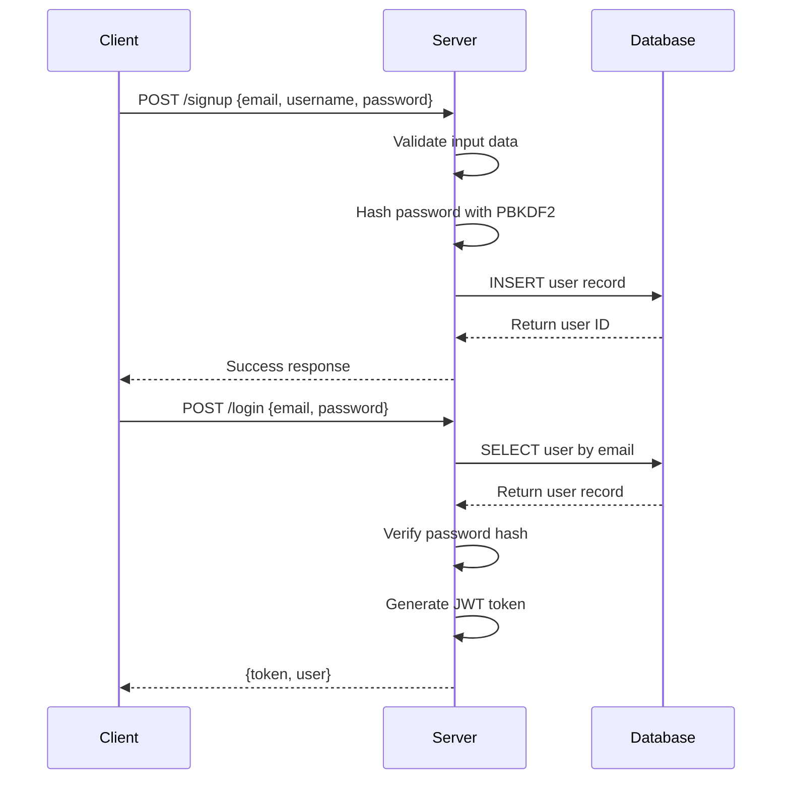

# Building a Full-Stack Multiplayer Pong Game: Complete Tutorial

## Table of Contents
1. [Project Overview](#1-project-overview)
2. [Prerequisites and Setup](#2-prerequisites-and-setup)
3. [Database Schema Design](#3-database-schema-design)
4. [User Management System](#4-user-management-system)
5. [Authentication & Security](#5-authentication--security)
6. [Backend Architecture](#6-backend-architecture)
7. [Frontend Implementation](#7-frontend-implementation)
8. [Step-by-Step Implementation](#8-step-by-step-implementation)
9. [Advanced Features](#9-advanced-features)
10. [Deployment](#10-deployment)

---

## 1. Project Overview

This tutorial will guide you through building a **multiplayer Pong game** with real-time features, user management, and tournament systems. The project uses:

- **Backend**: Fastify (Node.js) + TypeScript
- **Frontend**: Vanilla TypeScript + Tailwind CSS
- **Database**: SQLite with better-sqlite3
- **Real-time**: WebSockets for multiplayer sync
- **Authentication**: JWT + Google OAuth2 + 2FA
- **Infrastructure**: Docker Compose + Nginx

### Key Features
- Real-time multiplayer gameplay
- User registration and authentication
- Profile management with avatars
- Friend system and chat
- Tournament brackets
- Game statistics and history
- Two-factor authentication (2FA)
- Blockchain integration for score storage

---

## 2. Prerequisites and Setup

### Required Knowledge
- **JavaScript/TypeScript**: Essential for both frontend and backend
- **Node.js**: Backend runtime environment
- **SQL**: Database queries and relationships
- **HTML/CSS**: Frontend structure and styling
- **WebSockets**: Real-time communication concepts
- **RESTful APIs**: HTTP methods and API design

### Development Environment
```bash
# Node.js (v16 or later)
node --version

# Package managers
npm --version

# Optional: Docker for deployment
docker --version
```

### Initial Project Structure
```
project/
├── frontend/
│   ├── src/
│   ├── package.json
│   └── tsconfig.json
├── backend/
│   ├── routes/
│   ├── utils/
│   ├── middleware/
│   ├── package.json
│   └── server.ts
├── docker-compose.yml
└── nginx/
```

---

## 3. Database Schema Design

### Core Concept: Relational Database Design

Our SQLite database uses **foreign keys** to maintain data integrity and establish relationships between entities.

### 3.1 Users Table - The Foundation

```sql
CREATE TABLE IF NOT EXISTS users (
  id INTEGER PRIMARY KEY AUTOINCREMENT,
  username TEXT UNIQUE NOT NULL,
  email TEXT UNIQUE,
  password_hash TEXT,
  google_id TEXT,
  avatar_url TEXT,
  twofa_secret TEXT,
  twofa_enabled INTEGER DEFAULT 0,
  xp_level INTEGER DEFAULT 0,
  trophies INTEGER DEFAULT 0,
  wallet_address TEXT,
  created_at DATETIME DEFAULT CURRENT_TIMESTAMP
);
```

**Key Design Decisions:**
- `id`: Auto-incrementing primary key for efficient joins
- `username` & `email`: Unique constraints prevent duplicates
- `password_hash`: Never store plain text passwords
- `google_id`: Support for OAuth authentication
- `twofa_*`: Two-factor authentication fields
- `created_at`: Timestamp tracking

### 3.2 Friends System

```sql
CREATE TABLE IF NOT EXISTS friends (
  id INTEGER PRIMARY KEY AUTOINCREMENT,
  sender_id INTEGER NOT NULL,
  receiver_id INTEGER NOT NULL,
  status TEXT CHECK(status IN ('pending', 'accepted', 'blocked')) NOT NULL DEFAULT 'pending',
  created_at DATETIME DEFAULT CURRENT_TIMESTAMP,
  FOREIGN KEY (sender_id) REFERENCES users(id),
  FOREIGN KEY (receiver_id) REFERENCES users(id)
);
```

**Relationship Logic:**
- **One-to-Many**: One user can send multiple friend requests
- **Status-based**: Track friendship stages (pending → accepted)
- **Bidirectional**: Both users reference the same friendship record

### 3.3 Tournament System

```sql
CREATE TABLE IF NOT EXISTS tournaments (
  id INTEGER PRIMARY KEY AUTOINCREMENT,
  name TEXT NOT NULL,
  code TEXT UNIQUE NOT NULL,
  created_by INTEGER,
  status TEXT CHECK (status IN ('lobby','running','finished')) DEFAULT 'lobby',
  created_at DATETIME DEFAULT CURRENT_TIMESTAMP,
  winner_id INTEGER,
  FOREIGN KEY (created_by) REFERENCES users(id),
  FOREIGN KEY (winner_id) REFERENCES users(id)
);

CREATE TABLE IF NOT EXISTS tournament_players (
  id INTEGER PRIMARY KEY AUTOINCREMENT,
  tournament_id INTEGER NOT NULL,
  user_id INTEGER NOT NULL,
  joined_at DATETIME DEFAULT CURRENT_TIMESTAMP,
  UNIQUE(tournament_id, user_id),
  FOREIGN KEY (tournament_id) REFERENCES tournaments(id),
  FOREIGN KEY (user_id) REFERENCES users(id)
);
```

**Design Pattern: Join Table**
- `tournament_players` is a **junction table** for Many-to-Many relationships
- One tournament has many players, one player joins many tournaments
- `UNIQUE(tournament_id, user_id)` prevents duplicate entries

### 3.4 Match History

```sql
CREATE TABLE IF NOT EXISTS matches (
  id INTEGER PRIMARY KEY AUTOINCREMENT,
  tournament_id INTEGER,
  game_id TEXT UNIQUE,
  player1_id INTEGER NOT NULL,
  player2_id INTEGER NOT NULL,
  winner_id INTEGER,
  score_p1 INTEGER,
  score_p2 INTEGER,
  winner_score INTEGER,
  played_at DATETIME,
  FOREIGN KEY (tournament_id) REFERENCES tournaments(id),
  FOREIGN KEY (player1_id) REFERENCES users(id),
  FOREIGN KEY (player2_id) REFERENCES users(id),
  FOREIGN KEY (winner_id) REFERENCES users(id)
);
```

### 3.5 Notification System

```sql
CREATE TABLE IF NOT EXISTS notifications (
  id INTEGER PRIMARY KEY AUTOINCREMENT,
  user_id INTEGER NOT NULL,
  type TEXT NOT NULL,
  reference_id INTEGER,
  text TEXT NOT NULL,
  is_read INTEGER DEFAULT 0,
  created_at DATETIME DEFAULT CURRENT_TIMESTAMP,
  FOREIGN KEY(user_id) REFERENCES users(id)
);
```

---

## 4. User Management System

### 4.1 Understanding User Authentication Flow



### 4.2 Password Security Implementation

```typescript
// backend/utils/hash.ts
import crypto from 'crypto';

const ROUNDS = 100_000;
const DKLEN = 64;
const DIGEST = 'sha512';

export function hashPassword(plain: string, salt = crypto.randomBytes(16).toString('hex')): string {
    const hash = crypto.pbkdf2Sync(plain, salt, ROUNDS, DKLEN, DIGEST).toString('hex');
    return `${salt}:${hash}`;
}

export function verifyPassword(plain: string, stored: string): boolean {
    const [salt, original] = stored.split(':');
    if (!salt || !original) return false;

    const fresh = crypto.pbkdf2Sync(plain, salt, ROUNDS, DKLEN, DIGEST);
    return crypto.timingSafeEqual(fresh, Buffer.from(original, 'hex'));
}
```

**Security Concepts:**
- **PBKDF2**: Password-Based Key Derivation Function 2
- **Salt**: Random data to prevent rainbow table attacks
- **Timing-safe comparison**: Prevents timing attacks

### 4.3 JWT Token Management

```typescript
// backend/utils/jwt.ts
import jwt from 'jsonwebtoken';

export interface JWTPayload {
    userId: number;
    username: string;
    email: string;
}

const JWT_SECRET = process.env.JWT_SECRET || 'your-super-secret-key';

export function generateToken(payload: JWTPayload): string {
    return jwt.sign(payload, JWT_SECRET, { expiresIn: '7d' });
}

export function verifyToken(token: string): JWTPayload {
    return jwt.verify(token, JWT_SECRET) as JWTPayload;
}
```

### 4.4 User Registration Route

```typescript
// backend/routes/signup.ts
import { FastifyInstance } from 'fastify';
import db from '../utils/db';
import { hashPassword } from '../utils/hash';

function isValidEmail(email: string): boolean {
    return /^[^\s@]+@[^\s@]+\.[^\s@]+$/.test(email);
}

function isValidPassword(password: string): boolean {
    return password.length >= 8 &&
           /[A-Z]/.test(password) &&
           /[a-z]/.test(password) &&
           /\d/.test(password) &&
           /[^A-Za-z\d]/.test(password);
}

export default async function signupRoutes(fastify: FastifyInstance) {
    fastify.post('/signup', async (req, reply) => {
        const { username, email, password } = req.body as {
            username: string;
            email: string;
            password: string;
        };

        // Validation
        if (!username || !email || !password) {
            return reply.status(400).send({ error: 'All fields are required' });
        }

        if (username.length < 2) {
            return reply.status(400).send({ error: 'Username must be at least 2 characters long' });
        }

        if (!isValidEmail(email)) {
            return reply.status(400).send({ error: 'Invalid email format' });
        }

        if (!isValidPassword(password)) {
            return reply.status(400).send({
                error: 'Password must be at least 8 characters long and include uppercase, lowercase, number, and special character',
            });
        }

        // Check for existing user
        const existing = db
            .prepare('SELECT * FROM users WHERE username = ? OR email = ?')
            .get(username, email);

        if (existing) {
            return reply.status(400).send({ error: 'Username or email already taken' });
        }

        // Create user
        const password_hash = hashPassword(password);
        const stmt = db.prepare(`
            INSERT INTO users (username, email, password_hash)
            VALUES (?, ?, ?)
        `);
        const result = stmt.run(username, email, password_hash);

        return reply.send({ message: 'User created', user_id: result.lastInsertRowid });
    });
}
```

### 4.5 User Login with 2FA Support

```typescript
// backend/routes/login.ts
import { FastifyInstance } from 'fastify';
import db from '../utils/db';
import { verifyPassword } from '../utils/hash';
import { generateToken } from '../utils/jwt';
import speakeasy from 'speakeasy';

export default async function loginRoutes(fastify: FastifyInstance) {
    fastify.post('/login', async (req, reply) => {
        const { email, password, twofaToken } = req.body as {
            email: string;
            password: string;
            twofaToken?: string;
        };

        if (!email || !password) {
            return reply.status(400).send({ error: 'Email and password are required' });
        }

        const user = db.prepare('SELECT * FROM users WHERE email = ?').get(email);

        if (!user || !verifyPassword(password, user.password_hash)) {
            return reply.status(400).send({ error: 'Invalid email or password' });
        }

        // Handle 2FA if enabled
        if (user.twofa_enabled) {
            if (!twofaToken) {
                return reply.status(206).send({
                    message: '2FA required',
                    twofaRequired: true,
                });
            }

            const valid = speakeasy.totp.verify({
                secret: user.twofa_secret,
                encoding: 'base32',
                token: twofaToken,
                window: 1,
            });

            if (!valid) {
                return reply.status(401).send({ error: 'Invalid 2FA token' });
            }
        }

        const token = generateToken({
            userId: user.id,
            username: user.username,
            email: user.email,
        });

        return reply.send({
            message: 'Login successful',
            token,
            user: {
                id: user.id,
                username: user.username,
                email: user.email,
                xp_level: user.xp_level,
                trophies: user.trophies,
                avatar_url: user.avatar_url,
            },
        });
    });
}
```

### 4.6 Authentication Middleware

```typescript
// backend/middleware/auth.ts
import { FastifyRequest, FastifyReply } from 'fastify';
import { verifyToken } from '../utils/jwt';

export async function authMiddleware(request: FastifyRequest, reply: FastifyReply) {
    try {
        const authHeader = request.headers.authorization;
        if (!authHeader) {
            return reply.status(401).send({ error: 'No authorization header' });
        }

        const token = authHeader.split(' ')[1];
        if (!token) {
            return reply.status(401).send({ error: 'No token provided' });
        }

        const decoded = verifyToken(token);
        (request as any).user = decoded;
    } catch (error) {
        return reply.status(401).send({ error: 'Unauthorized' });
    }
}
```

---

## 5. Authentication & Security

### 5.1 Two-Factor Authentication (2FA)

```typescript
// backend/routes/2fa-setup.ts
import { FastifyInstance } from 'fastify';
import speakeasy from 'speakeasy';
import QRCode from 'qrcode';
import db from '../utils/db';
import { authMiddleware } from '../middleware/auth';

export default async function twoFactorRoutes(fastify: FastifyInstance) {
    fastify.post('/api/2fa/setup', 
        { preHandler: authMiddleware },
        async (req: any, reply) => {
            const { userId } = req.user;
            
            // Generate secret
            const secret = speakeasy.generateSecret({
                name: `Pong Game (${req.user.username})`,
                issuer: 'Transcendence',
            });

            // Generate QR code
            const qrCodeUrl = await QRCode.toDataURL(secret.otpauth_url);

            // Store secret temporarily (not enabled yet)
            db.prepare('UPDATE users SET twofa_secret = ? WHERE id = ?')
              .run(secret.base32, userId);

            return reply.send({
                secret: secret.base32,
                qrCode: qrCodeUrl,
            });
        }
    );

    fastify.post('/api/2fa/verify',
        { preHandler: authMiddleware },
        async (req: any, reply) => {
            const { token } = req.body;
            const { userId } = req.user;

            const user = db.prepare('SELECT twofa_secret FROM users WHERE id = ?')
                         .get(userId);

            const verified = speakeasy.totp.verify({
                secret: user.twofa_secret,
                encoding: 'base32',
                token,
                window: 1,
            });

            if (verified) {
                // Enable 2FA
                db.prepare('UPDATE users SET twofa_enabled = 1 WHERE id = ?')
                  .run(userId);
                
                return reply.send({ message: '2FA enabled successfully' });
            }

            return reply.status(400).send({ error: 'Invalid token' });
        }
    );
}
```

### 5.2 Google OAuth Integration

```typescript
// backend/routes/googleAuth.ts
import { FastifyInstance } from 'fastify';
import db from '../utils/db';
import { generateToken } from '../utils/jwt';

export default async function googleAuthRoutes(fastify: FastifyInstance) {
    fastify.get('/auth/google/callback', async (req, reply) => {
        try {
            const { token } = await fastify.googleOAuth2.getAccessTokenFromAuthorizationCodeFlow(req);
            
            const response = await fetch('https://www.googleapis.com/oauth2/v2/userinfo', {
                headers: { Authorization: `Bearer ${token.access_token}` },
            });
            
            const googleUser = await response.json();

            // Check if user exists
            let user = db.prepare('SELECT * FROM users WHERE google_id = ?')
                        .get(googleUser.id);

            if (!user) {
                // Create new user
                const stmt = db.prepare(`
                    INSERT INTO users (username, email, google_id, avatar_url)
                    VALUES (?, ?, ?, ?)
                `);
                const result = stmt.run(
                    googleUser.name,
                    googleUser.email,
                    googleUser.id,
                    googleUser.picture
                );
                
                user = { id: result.lastInsertRowid, ...googleUser };
            }

            const jwtToken = generateToken({
                userId: user.id,
                username: user.username,
                email: user.email,
            });

            return reply.redirect(`http://localhost:5500/?token=${jwtToken}`);
        } catch (error) {
            return reply.status(500).send({ error: 'Google authentication failed' });
        }
    });
}
```

---

## 6. Backend Architecture

### 6.1 Fastify Server Setup

```typescript
// backend/server.ts
import Fastify from 'fastify';
import cors from '@fastify/cors';
import websocketPlugin from '@fastify/websocket';
import multipart from '@fastify/multipart';
import staticFiles from '@fastify/static';

// Import routes
import signupRoutes from './routes/signup';
import loginRoutes from './routes/login';
import userRoutes from './routes/user';
import gameRoutes from './routes/gameSocketRoutes';

export const fastify = Fastify({
    logger: { level: 'info' }
});

const start = async () => {
    try {
        // Register plugins
        await fastify.register(cors, {
            origin: ['http://localhost:5500'],
            credentials: true,
        });
        
        await fastify.register(websocketPlugin);
        await fastify.register(multipart);
        
        // Register routes
        await fastify.register(signupRoutes);
        await fastify.register(loginRoutes);
        await fastify.register(userRoutes);
        await fastify.register(gameRoutes);

        // Start server
        await fastify.listen({ port: 3000, host: '0.0.0.0' });
        console.log('Server started on http://localhost:3000');
    } catch (err) {
        fastify.log.error(err);
        process.exit(1);
    }
};

start();
```

### 6.2 Database Connection

```typescript
// backend/utils/db.ts
const Database = require('better-sqlite3');
const path = require('path');

const dbPath = path.join(__dirname, '..', 'pong.db');
const db = new Database(dbPath);

// Enable foreign keys
db.exec(`PRAGMA foreign_keys = ON`);

// Initialize tables
db.exec(`
CREATE TABLE IF NOT EXISTS users (
  id INTEGER PRIMARY KEY AUTOINCREMENT,
  username TEXT UNIQUE NOT NULL,
  email TEXT UNIQUE,
  password_hash TEXT,
  google_id TEXT,
  avatar_url TEXT,
  twofa_secret TEXT,
  twofa_enabled INTEGER DEFAULT 0,
  xp_level INTEGER DEFAULT 0,
  trophies INTEGER DEFAULT 0,
  created_at DATETIME DEFAULT CURRENT_TIMESTAMP
);
`);

export default db;
```

---

## 7. Frontend Implementation

### 7.1 Authentication Client

```typescript
// frontend/src/auth.ts
import { API_BASE } from './config';

interface User {
    id: number;
    username: string;
    email: string;
    xp_level: number;
    trophies: number;
    avatar_url?: string;
}

class AuthManager {
    private token: string | null = null;
    private user: User | null = null;

    constructor() {
        this.token = localStorage.getItem('token');
        const userData = localStorage.getItem('user');
        this.user = userData ? JSON.parse(userData) : null;
    }

    async login(email: string, password: string, twofaToken?: string): Promise<{ success: boolean, twofaRequired?: boolean, error?: string }> {
        try {
            const response = await fetch(`${API_BASE}/login`, {
                method: 'POST',
                headers: { 'Content-Type': 'application/json' },
                body: JSON.stringify({ email, password, twofaToken }),
            });

            const data = await response.json();

            if (data.twofaRequired) {
                return { success: false, twofaRequired: true };
            }

            if (!response.ok) {
                return { success: false, error: data.error };
            }

            this.token = data.token;
            this.user = data.user;

            localStorage.setItem('token', this.token);
            localStorage.setItem('user', JSON.stringify(this.user));

            return { success: true };
        } catch (error) {
            return { success: false, error: 'Network error' };
        }
    }

    async signup(username: string, email: string, password: string): Promise<{ success: boolean, error?: string }> {
        try {
            const response = await fetch(`${API_BASE}/signup`, {
                method: 'POST',
                headers: { 'Content-Type': 'application/json' },
                body: JSON.stringify({ username, email, password }),
            });

            const data = await response.json();

            if (!response.ok) {
                return { success: false, error: data.error };
            }

            return { success: true };
        } catch (error) {
            return { success: false, error: 'Network error' };
        }
    }

    logout() {
        this.token = null;
        this.user = null;
        localStorage.removeItem('token');
        localStorage.removeItem('user');
    }

    isAuthenticated(): boolean {
        return !!this.token;
    }

    getAuthHeaders(): Record<string, string> {
        return this.token ? { Authorization: `Bearer ${this.token}` } : {};
    }

    getUser(): User | null {
        return this.user;
    }
}

export const authManager = new AuthManager();
```

### 7.2 API Client

```typescript
// frontend/src/api.ts
import { authManager } from './auth';
import { API_BASE } from './config';

class ApiClient {
    private async request<T>(
        endpoint: string, 
        options: RequestInit = {}
    ): Promise<{ data: T | null, error: string | null }> {
        try {
            const response = await fetch(`${API_BASE}${endpoint}`, {
                ...options,
                headers: {
                    'Content-Type': 'application/json',
                    ...authManager.getAuthHeaders(),
                    ...options.headers,
                },
            });

            if (!response.ok) {
                const error = await response.json();
                return { data: null, error: error.error || 'Request failed' };
            }

            const data = await response.json();
            return { data, error: null };
        } catch (error) {
            return { data: null, error: 'Network error' };
        }
    }

    async getProfile() {
        return this.request('/api/users/me');
    }

    async updateProfile(data: { username?: string, email?: string }) {
        return this.request('/api/users/edit-profile', {
            method: 'PUT',
            body: JSON.stringify(data),
        });
    }

    async uploadAvatar(file: File) {
        const formData = new FormData();
        formData.append('avatar', file);

        return fetch(`${API_BASE}/api/users/avatar`, {
            method: 'POST',
            headers: authManager.getAuthHeaders(),
            body: formData,
        });
    }

    async getFriends() {
        return this.request('/api/friends');
    }

    async sendFriendRequest(username: string) {
        return this.request('/api/friends/request', {
            method: 'POST',
            body: JSON.stringify({ username }),
        });
    }
}

export const apiClient = new ApiClient();
```

---

## 8. Step-by-Step Implementation

### Step 1: Project Initialization

```bash
# Create project structure
mkdir multiplayer-pong
cd multiplayer-pong

# Frontend setup
mkdir frontend
cd frontend
npm init -y
npm install typescript @types/node tailwindcss
npm install --save-dev http-server concurrently

# Backend setup
mkdir ../backend
cd ../backend
npm init -y
npm install fastify @fastify/cors @fastify/websocket
npm install better-sqlite3 jsonwebtoken bcrypt
npm install --save-dev @types/node @types/jsonwebtoken typescript ts-node
```

### Step 2: Database Setup

```typescript
// backend/utils/db.ts - Start with basic users table
const Database = require('better-sqlite3');
const db = new Database('pong.db');

db.exec(`
CREATE TABLE IF NOT EXISTS users (
  id INTEGER PRIMARY KEY AUTOINCREMENT,
  username TEXT UNIQUE NOT NULL,
  email TEXT UNIQUE NOT NULL,
  password_hash TEXT NOT NULL,
  created_at DATETIME DEFAULT CURRENT_TIMESTAMP
);
`);

export default db;
```

### Step 3: Basic Authentication

```typescript
// backend/routes/auth.ts - Simple login/signup
import { FastifyInstance } from 'fastify';
import bcrypt from 'bcrypt';
import jwt from 'jsonwebtoken';
import db from '../utils/db';

export default async function authRoutes(fastify: FastifyInstance) {
    fastify.post('/signup', async (req, reply) => {
        const { username, email, password } = req.body;
        
        const hashedPassword = await bcrypt.hash(password, 10);
        
        try {
            const result = db.prepare(`
                INSERT INTO users (username, email, password_hash) 
                VALUES (?, ?, ?)
            `).run(username, email, hashedPassword);
            
            reply.send({ message: 'User created', id: result.lastInsertRowid });
        } catch (error) {
            reply.status(400).send({ error: 'User already exists' });
        }
    });

    fastify.post('/login', async (req, reply) => {
        const { email, password } = req.body;
        
        const user = db.prepare('SELECT * FROM users WHERE email = ?').get(email);
        
        if (!user || !await bcrypt.compare(password, user.password_hash)) {
            return reply.status(401).send({ error: 'Invalid credentials' });
        }
        
        const token = jwt.sign(
            { userId: user.id, username: user.username },
            process.env.JWT_SECRET || 'secret',
            { expiresIn: '7d' }
        );
        
        reply.send({ token, user: { id: user.id, username: user.username } });
    });
}
```

### Step 4: Frontend Authentication

```html
<!-- frontend/index.html - Basic structure -->
<!DOCTYPE html>
<html>
<head>
    <title>Multiplayer Pong</title>
    <script src="https://cdn.tailwindcss.com"></script>
</head>
<body>
    <div id="login-form" class="max-w-md mx-auto mt-8">
        <form id="auth-form">
            <input id="email" type="email" placeholder="Email" required>
            <input id="password" type="password" placeholder="Password" required>
            <button type="submit">Login</button>
            <button type="button" id="switch-mode">Sign Up</button>
        </form>
    </div>
    <div id="game-area" class="hidden">
        <canvas id="pong-canvas" width="800" height="400"></canvas>
    </div>
    <script src="js/auth.js"></script>
    <script src="js/game.js"></script>
</body>
</html>
```

```typescript
// frontend/src/auth.ts - Basic auth handling
class Auth {
    private token: string | null = localStorage.getItem('token');

    async login(email: string, password: string) {
        const response = await fetch('/api/login', {
            method: 'POST',
            headers: { 'Content-Type': 'application/json' },
            body: JSON.stringify({ email, password })
        });

        if (response.ok) {
            const data = await response.json();
            this.token = data.token;
            localStorage.setItem('token', this.token);
            this.showGameArea();
        }
    }

    private showGameArea() {
        document.getElementById('login-form').classList.add('hidden');
        document.getElementById('game-area').classList.remove('hidden');
    }
}

const auth = new Auth();
```

### Step 5: Add Profile Management

Gradually expand the users table and add profile routes:

```typescript
// Add to backend/utils/db.ts
db.exec(`
ALTER TABLE users ADD COLUMN avatar_url TEXT;
ALTER TABLE users ADD COLUMN xp_level INTEGER DEFAULT 0;
ALTER TABLE users ADD COLUMN trophies INTEGER DEFAULT 0;
`);
```

```typescript
// backend/routes/users.ts
export default async function userRoutes(fastify: FastifyInstance) {
    fastify.get('/api/users/me', 
        { preHandler: authMiddleware },
        async (req, reply) => {
            const { userId } = req.user;
            const user = db.prepare(`
                SELECT id, username, email, xp_level, trophies, avatar_url
                FROM users WHERE id = ?
            `).get(userId);
            
            reply.send(user);
        }
    );

    fastify.put('/api/users/profile',
        { preHandler: authMiddleware },
        async (req, reply) => {
            const { userId } = req.user;
            const { username, email } = req.body;
            
            db.prepare(`
                UPDATE users 
                SET username = ?, email = ? 
                WHERE id = ?
            `).run(username, email, userId);
            
            reply.send({ message: 'Profile updated' });
        }
    );
}
```

### Step 6: Friends System

```typescript
// Add friends table and routes
db.exec(`
CREATE TABLE IF NOT EXISTS friends (
  id INTEGER PRIMARY KEY AUTOINCREMENT,
  sender_id INTEGER NOT NULL,
  receiver_id INTEGER NOT NULL,
  status TEXT DEFAULT 'pending',
  created_at DATETIME DEFAULT CURRENT_TIMESTAMP,
  FOREIGN KEY (sender_id) REFERENCES users(id),
  FOREIGN KEY (receiver_id) REFERENCES users(id)
);
`);

// backend/routes/friends.ts
export default async function friendRoutes(fastify: FastifyInstance) {
    fastify.post('/api/friends/request',
        { preHandler: authMiddleware },
        async (req, reply) => {
            const { userId } = req.user;
            const { username } = req.body;
            
            const friend = db.prepare('SELECT id FROM users WHERE username = ?').get(username);
            
            if (!friend) {
                return reply.status(404).send({ error: 'User not found' });
            }
            
            db.prepare(`
                INSERT INTO friends (sender_id, receiver_id) 
                VALUES (?, ?)
            `).run(userId, friend.id);
            
            reply.send({ message: 'Friend request sent' });
        }
    );
}
```

### Step 7: Real-time Game with WebSockets

```typescript
// backend/routes/gameSocket.ts
import { FastifyInstance } from 'fastify';

export default async function gameSocketRoutes(fastify: FastifyInstance) {
    fastify.get('/ws', { websocket: true }, (connection, req) => {
        connection.socket.send(JSON.stringify({ type: 'connected' }));
        
        connection.socket.on('message', (message) => {
            const data = JSON.parse(message.toString());
            
            switch (data.type) {
                case 'paddle_move':
                    // Broadcast to other players
                    fastify.websocketServer.clients.forEach(client => {
                        if (client !== connection.socket) {
                            client.send(JSON.stringify({
                                type: 'opponent_paddle',
                                y: data.y
                            }));
                        }
                    });
                    break;
            }
        });
    });
}
```

```typescript
// frontend/src/game.ts
class PongGame {
    private ws: WebSocket;
    private canvas: HTMLCanvasElement;
    private ctx: CanvasRenderingContext2D;

    constructor() {
        this.canvas = document.getElementById('pong-canvas') as HTMLCanvasElement;
        this.ctx = this.canvas.getContext('2d')!;
        this.connectWebSocket();
        this.setupControls();
        this.gameLoop();
    }

    private connectWebSocket() {
        this.ws = new WebSocket('ws://localhost:3000/ws');
        
        this.ws.onmessage = (event) => {
            const data = JSON.parse(event.data);
            
            switch (data.type) {
                case 'opponent_paddle':
                    this.opponentY = data.y;
                    break;
            }
        };
    }

    private setupControls() {
        this.canvas.addEventListener('mousemove', (e) => {
            const rect = this.canvas.getBoundingClientRect();
            this.playerY = e.clientY - rect.top;
            
            this.ws.send(JSON.stringify({
                type: 'paddle_move',
                y: this.playerY
            }));
        });
    }
}
```

---

## 9. Advanced Features

### 9.1 Tournament System

The tournament system uses a bracket-style elimination format:

```typescript
// backend/tournamentManager.ts
export class TournamentManager {
    createTournament(name: string, createdBy: number): string {
        const code = this.generateCode();
        
        db.prepare(`
            INSERT INTO tournaments (name, code, created_by)
            VALUES (?, ?, ?)
        `).run(name, code, createdBy);
        
        return code;
    }

    joinTournament(code: string, userId: number): boolean {
        const tournament = db.prepare(`
            SELECT id FROM tournaments 
            WHERE code = ? AND status = 'lobby'
        `).get(code);
        
        if (!tournament) return false;
        
        db.prepare(`
            INSERT INTO tournament_players (tournament_id, user_id)
            VALUES (?, ?)
        `).run(tournament.id, userId);
        
        return true;
    }

    startTournament(tournamentId: number): Match[] {
        const players = db.prepare(`
            SELECT u.id, u.username 
            FROM tournament_players tp
            JOIN users u ON tp.user_id = u.id
            WHERE tp.tournament_id = ?
        `).all(tournamentId);
        
        return this.generateBracket(players, tournamentId);
    }
}
```

### 9.2 Statistics and Analytics

```typescript
// backend/routes/stats.ts
export default async function statsRoutes(fastify: FastifyInstance) {
    fastify.get('/api/stats/user/:id',
        async (req, reply) => {
            const userId = parseInt(req.params.id);
            
            const stats = db.prepare(`
                SELECT 
                    COUNT(*) as total_games,
                    SUM(CASE WHEN winner_id = ? THEN 1 ELSE 0 END) as wins,
                    AVG(CASE WHEN player1_id = ? THEN score_p1 ELSE score_p2 END) as avg_score
                FROM matches 
                WHERE player1_id = ? OR player2_id = ?
            `).get(userId, userId, userId, userId);
            
            reply.send(stats);
        }
    );
}
```

### 9.3 Blockchain Integration

```solidity
// smart-contracts/contracts/ScoreBoard.sol
pragma solidity ^0.8.0;

contract ScoreBoard {
    struct Score {
        address player;
        uint256 score;
        uint256 tournamentId;
        uint256 timestamp;
    }
    
    mapping(uint256 => mapping(address => uint256)) public scores;
    mapping(uint256 => address[]) public players;
    
    event ScoreUpdated(uint256 tournamentId, address player, uint256 score);
    
    function updateScore(uint256 tournamentId, uint256 score) external {
        scores[tournamentId][msg.sender] = score;
        
        // Add to players list if first time
        if (score > 0 && scores[tournamentId][msg.sender] == score) {
            players[tournamentId].push(msg.sender);
        }
        
        emit ScoreUpdated(tournamentId, msg.sender, score);
    }
    
    function getScore(uint256 tournamentId, address player) external view returns (uint256) {
        return scores[tournamentId][player];
    }
}
```

---

## 10. Deployment

### 10.1 Docker Configuration

```yaml
# docker-compose.yml
version: '3.8'

services:
  frontend:
    build:
      context: .
      dockerfile: dockerfile
    ports:
      - "5500:5500"
    depends_on:
      - backend

  backend:
    build:
      context: ./backend
      dockerfile: dockerfile
    ports:
      - "3000:3000"
    environment:
      - JWT_SECRET=your-super-secret-jwt-key
      - GOOGLE_CLIENT_ID=your-google-client-id
      - GOOGLE_CLIENT_SECRET=your-google-client-secret
    volumes:
      - ./backend/pong.db:/app/pong.db

  nginx:
    image: nginx:alpine
    ports:
      - "8090:80"
    volumes:
      - ./nginx/nginx.conf:/etc/nginx/nginx.conf
    depends_on:
      - frontend
      - backend
```

```dockerfile
# Frontend Dockerfile
FROM node:18-alpine
WORKDIR /app
COPY package*.json ./
RUN npm install
COPY . .
RUN npm run build
EXPOSE 5500
CMD ["npm", "start"]
```

```dockerfile
# Backend Dockerfile
FROM node:18-alpine
WORKDIR /app
COPY package*.json ./
RUN npm install
COPY . .
RUN npm run build
EXPOSE 3000
CMD ["npm", "start"]
```

### 10.2 Environment Variables

```bash
# .env file
JWT_SECRET=your-256-bit-secret-key-here
GOOGLE_CLIENT_ID=your-google-oauth-client-id
GOOGLE_CLIENT_SECRET=your-google-oauth-client-secret
IP_ADDR=localhost
DATABASE_URL=./pong.db
```

---

## Key Learning Points

### 1. Database Design Principles
- **Normalization**: Reduce data redundancy through proper table relationships
- **Foreign Keys**: Maintain data integrity across related tables  
- **Indexing**: Use unique constraints and indexes for performance
- **Data Types**: Choose appropriate SQLite data types for each field

### 2. Authentication Security
- **Never store plain text passwords** - always hash with salt
- **Use strong JWT secrets** - generate random 256-bit keys
- **Implement 2FA** for additional security layer
- **Validate all inputs** on both client and server sides

### 3. Real-time Architecture
- **WebSockets** for bidirectional real-time communication
- **State synchronization** between multiple clients
- **Event-driven design** for scalable multiplayer features

### 4. API Design Best Practices
- **RESTful endpoints** with proper HTTP methods
- **Consistent error responses** with meaningful messages
- **Authentication middleware** for protected routes
- **Input validation** and sanitization

This tutorial provides a complete foundation for building a sophisticated multiplayer game with modern web technologies. Each concept builds upon the previous one, creating a comprehensive understanding of full-stack development with user management at its core.